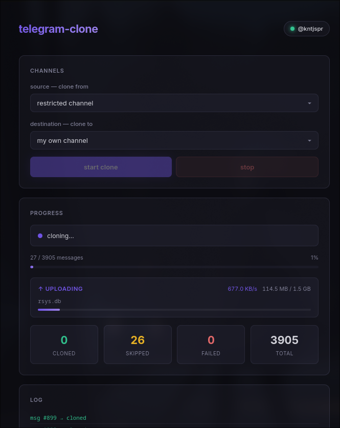

telegram channel cloner built on telethon. logs into your account, mirrors messages and files from a source channel to a destination channel. tracks what's been cloned so re-runs skip duplicates. deletes downloaded files after upload.

## setup

```bash
uv sync
```

copy `.env.example` to `.env` and fill in your credentials:

```bash
cp .env.example .env
```

you need `API_ID` and `API_HASH` from [my.telegram.org](https://my.telegram.org/apps).

## usage

```bash
uv run main.py
```

on first run it'll ask for your phone number and OTP. after that it uses a session file so you stay logged in.

you can set `SOURCE_CHANNEL` and `DEST_CHANNEL` in `.env` or pick interactively from a list of your channels.

## web panel

```bash
uv run web.py
```

opens at `http://localhost:5000`. pick source/dest channels from dropdowns, hit start, and watch live progress. you can stop mid-clone and resume later.

## what it clones

- photos, videos, documents, audio, voice notes, gifs, stickers
- text-only messages with formatting preserved
- captions on media

## how tracking works

a `clone_tracker.json` file records every message ID that's been transferred. if you stop and restart, it picks up where it left off. no duplicate uploads.

## env reference

| var | description |
|---|---|
| `API_ID` | telegram api id |
| `API_HASH` | telegram api hash |
| `PHONE` | phone number with country code |
| `SOURCE_CHANNEL` | source channel username or id |
| `DEST_CHANNEL` | destination channel username or id |

