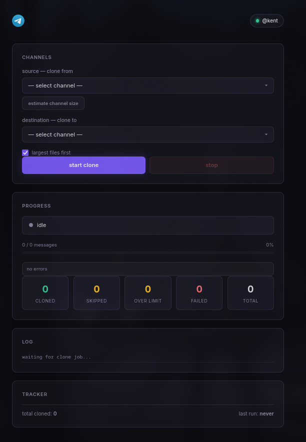

# Telegram Clone


A tool to clone Telegram channels, tracking cloned messages, files and media and providing a web interface.




## Windows Quickstart

No git, no python, no setup -- just paste this into PowerShell and follow the prompts.

**Step 1** -- allow script execution (one-time, safe to run):

```powershell
Set-ExecutionPolicy RemoteSigned -Scope CurrentUser -Force
```

**Step 2** -- download and run the installer:

```powershell
irm https://raw.githubusercontent.com/kntjspr/telegram-clone/main/install.ps1 | iex
```

The script will:
- install git if missing (via winget or direct download)
- install python 3.12+ and uv if missing
- clone this repo to `~/telegram-clone`
- walk you through filling in your `.env` (API keys, channels, etc.)
- install all dependencies and launch the web interface at `http://localhost:5000`


## Manual Installation

`uv` installation docs: https://docs.astral.sh/uv/getting-started/installation/

Using `uv`:
```bash
uv sync
```

Set up your `.env` file from `.env.example` with your Telegram API credentials and other settings.

## Usage

By default, the application runs the web interface.

```bash
uv run src/telegram_clone/main.py
```

Access the web panel at `http://localhost:5000` (or the configured `WEB_PORT`).

If you prefer the command-line interface, pass the `--cli` flag.

```bash
uv run src/telegram_clone/main.py --cli
```

## Docker Usage

You can run the application using Docker on both Linux and Windows. Ensure you have Docker installed and running.

### 1. Build the image
**Linux / macOS**
```bash
docker build -t telegram-clone .
```

**Windows (PowerShell)**
```powershell
docker build -t telegram-clone .
```

### 2. Run the container
You need to pass your `.env` file, publish the web port, and mount a volume for your Telegram session and database files to persist data.

**Linux / macOS**
```bash
docker run -it --rm \
  --env-file .env \
  -p 5000:5000 \
  -v $(pwd):/app \
  telegram-clone
```

**Windows (PowerShell)**
```powershell
docker run -it --rm `
  --env-file .env `
  -p 5000:5000 `
  -v ${PWD}:/app `
  telegram-clone
```

To run the command-line interface via Docker, append the `--cli` flag to the run command.
```bash
docker run -it --rm \
  --env-file .env \
  -v $(pwd):/app \
  telegram-clone --cli
```
